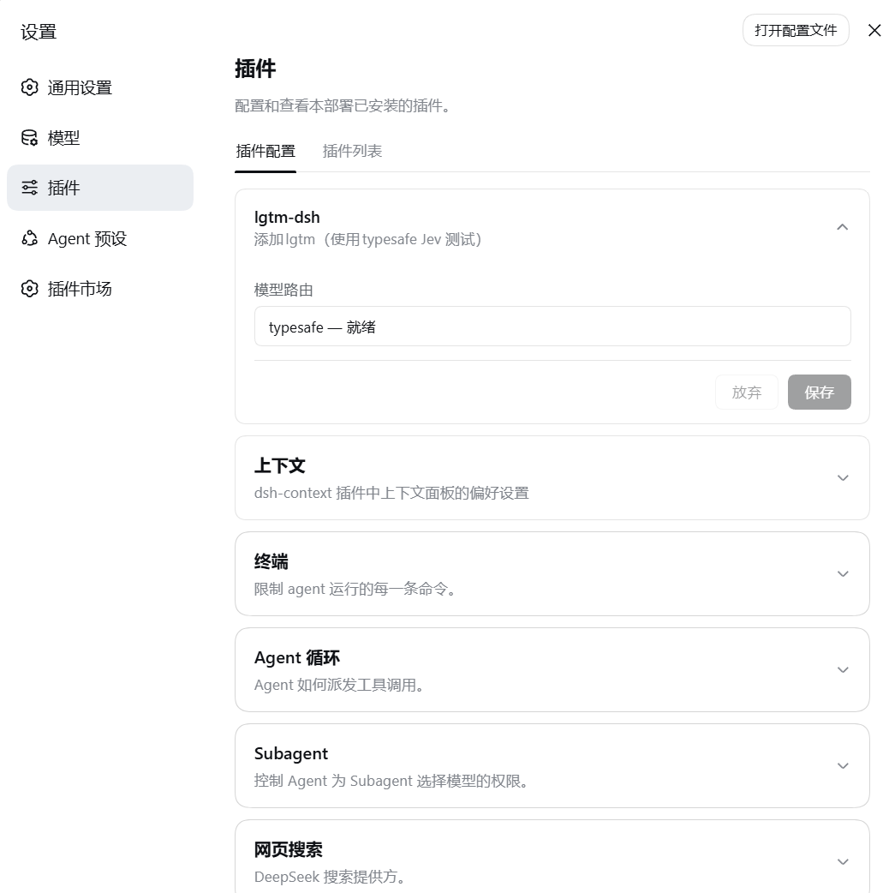

# lgtm-dsh

lgtm-dsh 是个 DSH 插件，负责自动装好 [lgtm](https://github.com/stardeckai/lgtm)、复用 DSH 里已配好的 Jev，并让 agent 在测试阶段自动调用。

## 安装

```sh
# 从本仓库装：clone 或解压后，在仓库根目录执行
dsh plugin --profile web add .

# 或者打成 tarball 再装
npm pack
dsh plugin --profile web add ./lgtm-dsh-*.tgz
```

装完重启 web 服务生效。还没发布到 npm，所以 `dsh plugin add lgtm-dsh` 暂时用不了。

## 设置

1. **设置 → 模型 → 添加自定义提供方**，key 存进 `TYPESAFE_API_KEY`（目前只支持 typesafe）。
2. **设置 → 插件 → 插件配置 → lgtm-dsh**，选「模型路由」——决定用哪把 key，默认选中靠前的一条可用路由。



## skill 触发时机

| skill | 什么时候触发 |
|---|---|
| `lgtm` | 你问「这些测试有没有用」「哪些测试该删、该加强」的时候 |
| `actually-test` | 你说「给刚写/刚改的东西补测试」的时候；它指导写测试，并在过程中反复用 `lgtm_audit` 迭代 |

插件权限：它只做四件事——把 `@stardeckai/lgtm` 装进当前 profile 的 `node_modules`、往工具列表注册 `lgtm_status` 和 `lgtm_audit`、把两份 skill 挂进 skill 目录、读 `llm-pi-ai` 里那条路由的 `apiKeyEnv` 并从凭据服务解析出 key。那个 key 不落盘、不进日志、不进工具结果，只出现在它启动的那一个子进程的环境变量里。子进程用调用方会话自己的沙箱策略运行，插件不会给自己提权（往工作区外写会被沙箱拒掉）。它不装全局、不动 PATH、不改 profile 配置、不改 lockfile；联网和写 `node_modules/.cache/lgtm` 缓存都是 lgtm 自己的行为，不由插件代理。

MIT
